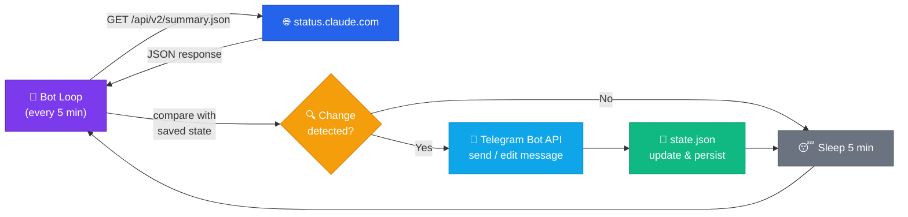

<p align="center">
  
</p>

<h1 align="center">🤖 Claude Status Telegram Bot</h1>

<p align="center">
  <em>Get instant Telegram notifications when Claude goes down or has issues</em>
</p>

<p align="center">
  <a href="https://status.claude.com"></a>
  <a href="https://www.python.org/"></a>
  <a href="https://hub.docker.com/"></a>
  <a href="LICENSE"></a>
</p>

---

## 📡 What it does

Polls the [status.claude.com](https://status.claude.com/) API every 5 minutes and sends you a Telegram message when something happens:

| Event | Example |
|-------|---------|
| 🚨 **New incident** | API outage, degraded performance |
| 📝 **Incident update** | Edits the original message with full timeline |
| ⚡ **Overall status change** | 🟢 Operational → 🟠 Major Outage |
| 🔄 **Component status change** | claude.ai, API, Claude Code, platform |

> 💡 When an incident gets updates (investigating → identified → monitoring → resolved), the bot **edits the same Telegram message** to keep your chat clean.

## 🚀 Quick Start

### 1. Create a Telegram Bot

Open [@BotFather](https://t.me/BotFather) → `/newbot` → save the **token**

### 2. Get your Chat ID

Message [@userinfobot](https://t.me/userinfobot) → it replies with your **ID**

### 3. Deploy

```bash
git clone https://github.com/nimbo78/claude-status-telegram-bot.git
cd claude-status-telegram-bot
cp .env.example .env
```

Edit `.env`:
```env
TELEGRAM_BOT_TOKEN=123456:ABC-DEF1234ghIkl-zyx57W2v
TELEGRAM_CHAT_ID=987654321
```

```bash
docker compose up -d
```

✅ That's it! You'll get a startup message confirming everything works.

## 🐳 Docker Commands

```bash
docker compose up -d          # start
docker compose logs -f        # follow logs
docker compose restart        # restart
docker compose down           # stop
docker compose up -d --build  # rebuild after code changes
```

## 🖥️ Run Without Docker

```bash
python -m venv .venv
source .venv/bin/activate
pip install -r requirements.txt
cp .env.example .env
# edit .env
STATE_FILE=./state.json python bot.py
```

## ⚙️ Configuration

| Variable | Default | Description |
|:---------|:--------|:------------|
| `TELEGRAM_BOT_TOKEN` | — | 🔑 Bot token from @BotFather |
| `TELEGRAM_CHAT_ID` | — | 💬 Chat ID(s), comma-separated for multiple |
| `POLL_INTERVAL` | `300` | ⏱️ Seconds between checks (5 min) |
| `STATUSPAGE_BASE_URL` | `https://status.claude.com` | 🌐 Statuspage URL |
| `STATE_FILE` | `/data/state.json` | 💾 State persistence path |
| `LOG_LEVEL` | `INFO` | 📋 DEBUG / INFO / WARNING / ERROR |

## 📢 Send to a Channel

1. Create a Telegram channel
2. Add your bot as **admin**
3. Set `TELEGRAM_CHAT_ID` to `@channel_name` (public) or `-100xxxxx` (private)

## 👥 Multiple Destinations

Send to several chats at once — comma-separated:

```env
TELEGRAM_CHAT_ID=-1003752855916,123456789,@my_channel
```

Works with any mix of user IDs, group IDs, and channel usernames.

## 📱 Commands

| Command | Description |
|:--------|:------------|
| `/status` | 📊 Show current Claude status, components & active incidents |

Send `/status` to the bot in a private chat anytime to get an instant status check.

## 🏗️ How It Works



The bot uses a single API endpoint (`/api/v2/summary.json`) — unauthenticated, no rate limit — which returns everything: overall status, components, incidents with updates, and scheduled maintenances.

State is persisted to a JSON file in a Docker volume, so restarts don't cause duplicate notifications.

## 📁 Project Structure

```
├── bot.py           # Main polling loop & change detection
├── statuspage.py    # Statuspage API client & data models
├── notifier.py      # Telegram message formatting & sending/editing
├── storage.py       # JSON state persistence
├── config.py        # Environment variable loading
├── Dockerfile       # Python 3.12-slim image
├── docker-compose.yml
├── .env.example     # Configuration template
└── requirements.txt
```

## 📝 License

[MIT](LICENSE) — do whatever you want with it.

---

<p align="center">
  Made to never miss a Claude outage again ⚡
</p>
